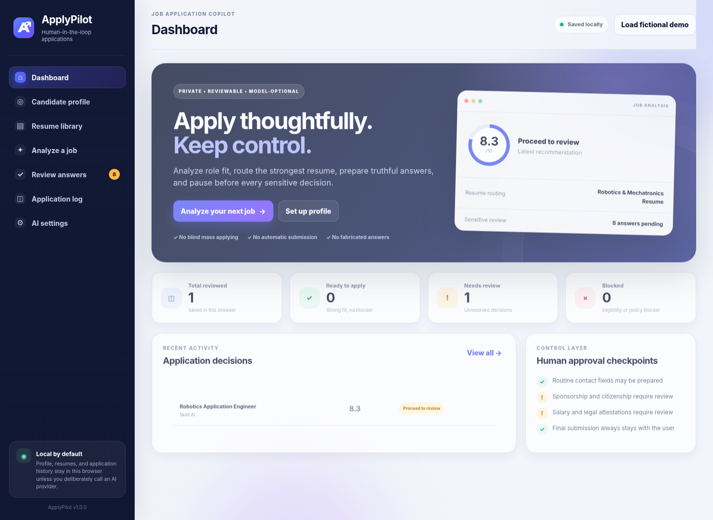
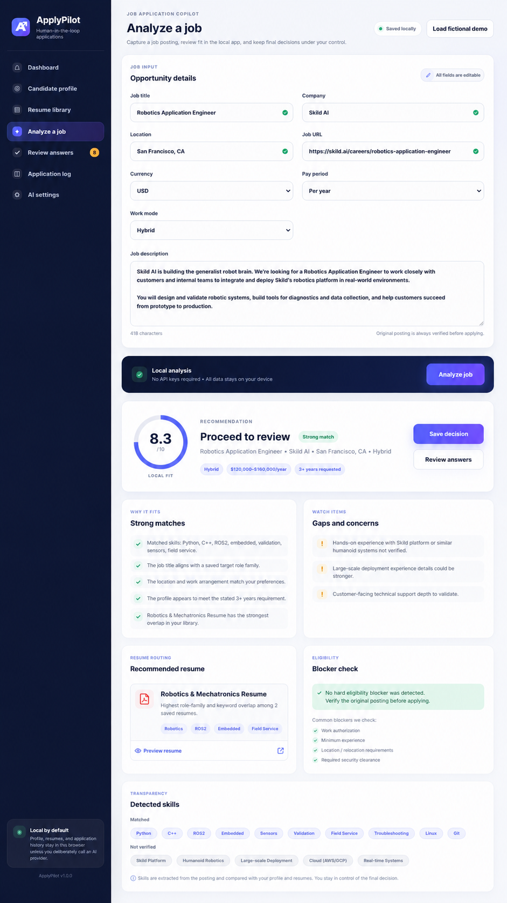
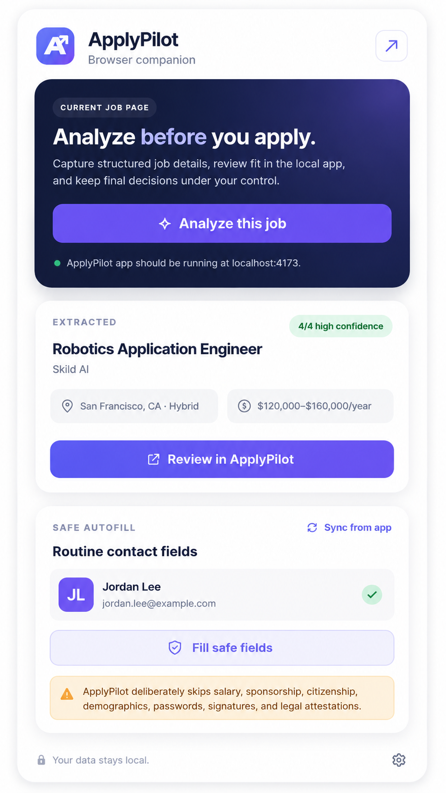
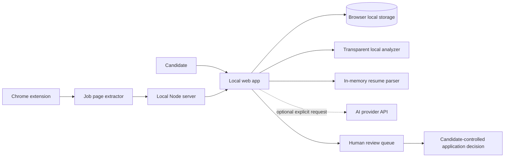

<p align="center">
  
</p>

<p align="center">
  <strong>A privacy-first, human-in-the-loop job application copilot.</strong><br>
  Analyze fit, route the strongest resume, prepare truthful answers, and keep the candidate in control of sensitive decisions.
</p>

<p align="center">
  
  
  
  
</p>



▶ **[Watch the 34-second LinkedIn-ready product demo](media/ApplyPilot_LinkedIn_Demo_1080x1350.mp4)**

Use `media/social-preview.png` as the GitHub repository social preview.

## Why ApplyPilot exists

Job applications repeat the same facts across different systems, but several answers—work authorization, citizenship, export control, compensation, demographics, attestations, and signatures—are too consequential for blind automation.

ApplyPilot separates **repetitive preparation** from **human decisions**:

- builds a reusable candidate source of truth;
- reads PDF, DOCX, TXT, and Markdown resumes locally;
- extracts title, company, location, work mode, and compensation from job pages;
- scores role fit using transparent local heuristics;
- routes the strongest resume for the role;
- detects common citizenship, clearance, sponsorship, and contract blockers;
- generates a review queue for proposed application answers;
- fills only routine contact fields through an explicit browser-extension action;
- never submits an application automatically.

> ApplyPilot is a decision-support tool, not a hiring predictor, immigration adviser, or autonomous mass-application bot.

## Product tour

### Job analysis and extraction



The extension extracts job data in this order:

1. `schema.org/JobPosting` structured data;
2. known and generic page elements;
3. visible-text heuristics;
4. editable manual fallback.

Every extracted field carries a confidence indicator and remains editable before analysis.

### Browser companion

<p align="center"></p>

The extension acts only after the user clicks a button. It can:

- capture the current job page;
- show extracted location and compensation;
- sync routine contact fields from the local app;
- fill name, email, phone, location, LinkedIn, and portfolio/website fields;
- deliberately skip sensitive, legal, demographic, salary, password, and signature fields.

## Quick start

### Requirements

- Node.js 18 or newer
- Chrome, Chromium, Edge, or another Chromium-based browser for the extension

### Run locally

```bash
git clone https://github.com/YOUR_USERNAME/applypilot.git
cd applypilot
npm install
npm start
```

Open `http://localhost:4173`.

Convenience launchers are also included:

- Windows: `RUN_WINDOWS.bat`
- macOS/Linux: `RUN_MAC_LINUX.sh`

### Load the Chrome extension

1. Start the ApplyPilot app.
2. Open `chrome://extensions`.
3. Enable **Developer mode**.
4. Select **Load unpacked**.
5. Choose the repository’s `extension` folder.
6. Pin ApplyPilot from the browser’s extension menu.

The extension needs only `activeTab`, `scripting`, and `storage`, plus access to the local ApplyPilot server.

## Optional AI providers

Local mode is the default and requires no key. The settings page can optionally call:

- OpenAI Responses API
- Anthropic Messages API
- Gemini Generate Content API

API keys are entered by the user and stored only in browser storage. They are never written to the repository or server filesystem. Provider calls fall back to local analysis if they fail.

Model identifiers change over time. Confirm that the model entered in Settings is available in your provider account.

## Architecture



### Data boundaries

| Data | Default location | Sent externally? |
|---|---|---|
| Candidate profile | Browser local storage | Only when the user selects an AI provider |
| Resume metadata and extracted text | Browser local storage | Only for the current provider analysis |
| Resume files | Parsed in server memory | No file is written to disk |
| Application log | Browser local storage | No |
| API key | Browser local/session storage | Only to the selected provider |
| Browser capture | Local server memory | No, unless used in a provider analysis |

## Repository layout

```text
ApplyPilot/
├── public/                  # Local web application
│   ├── assets/              # Brand and PWA assets
│   ├── index.html
│   ├── styles.css
│   └── app.js
├── extension/               # Manifest V3 browser companion
├── src/                     # Extraction, analysis, providers, resume parsing
├── tests/                   # Node test suite
├── examples/                # Fictional data only
├── docs/                    # Architecture, deployment, safety, launch guides
├── media/                   # Screenshots, social preview, and launch demo
├── .github/                 # CI and contribution templates
├── server.mjs
└── package.json
```

## Scripts

```bash
npm start          # Start ApplyPilot on localhost:4173
npm run dev        # Restart the server on source changes
npm test           # Run analyzer, extractor, and resume-parser tests
npm run lint       # Scan repository text for obvious secret markers
npm run verify     # Run lint and tests
npm run demo:record # Rebuild the 34-second demo (requires FFmpeg)
```

## Safety decisions

ApplyPilot will not:

- automatically search and apply to large numbers of jobs;
- bypass CAPTCHA, 2FA, access controls, or website restrictions;
- fabricate qualifications or candidate facts;
- automatically answer sensitive eligibility questions;
- agree to legal terms or provide an electronic signature;
- press the final submission button.

See [PRIVACY.md](PRIVACY.md), [SECURITY.md](SECURITY.md), and [docs/SAFETY_MODEL.md](docs/SAFETY_MODEL.md).

## Known limitations

- Job-site markup changes frequently, so extraction can require manual correction.
- The extension’s safe autofill is intentionally narrow.
- Resume extraction quality depends on document structure; image-only PDFs are not OCR’d.
- Local fit scoring is heuristic and must not be interpreted as an employer’s decision.
- This repository is a local-first MVP, not a hosted multi-user SaaS deployment.

## Roadmap

See [ROADMAP.md](ROADMAP.md). For publishing and deployment, see [docs/GITHUB_SETUP.md](docs/GITHUB_SETUP.md) and [docs/DEPLOYMENT.md](docs/DEPLOYMENT.md). The next priorities are encrypted IndexedDB storage, user-defined answer templates, broader ATS testing, accessibility audits, and provider-side structured-output schemas.

## Contributing

Contributions are welcome. Start with [CONTRIBUTING.md](CONTRIBUTING.md) and the issue templates. Please do not submit real resumes, personal application answers, API keys, or job-board credentials in issues or pull requests.

## License

MIT. See [LICENSE](LICENSE).

## Disclaimer

ApplyPilot is provided for educational and productivity purposes. Users are responsible for verifying every answer, complying with job-site terms, and obtaining qualified legal or immigration advice when needed.

## Windows installation note

The Windows launcher installs runtime dependencies from the public npm registry. If installation fails, open Command Prompt in the project folder and run:

```bash
npm install --omit=dev --registry=https://registry.npmjs.org/
npm start
```
