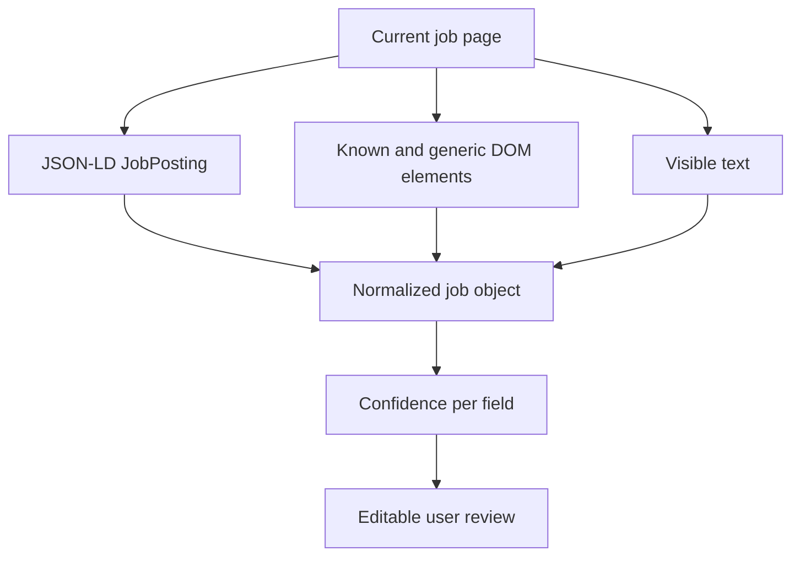

# Architecture

ApplyPilot is a local web application and a Manifest V3 browser extension.

## Components

### Local Node server

`server.mjs` serves static assets and exposes narrow local endpoints:

- `POST /api/capture` — receives a user-triggered browser capture and extracts job fields;
- `GET /api/capture` — returns the latest in-memory capture;
- `POST /api/profile-sync` — exposes routine contact fields to the extension in memory;
- `POST /api/resume/extract` — parses a resume in memory;
- `POST /api/analyze` — runs local analysis and optionally an AI-provider adapter.

The server binds to `127.0.0.1` by default.

### Browser application

The web interface stores the workspace in browser local storage. It owns candidate facts, resume records, job inputs, review state, provider settings, and the application log.

### Extension

The extension uses `activeTab` and `scripting` only after an explicit click. It reads structured `JobPosting` data and visible page text, sends them to the local server, and can fill a narrow set of routine contact fields.

## Extraction pipeline

## Analysis pipeline

The local analyzer performs role-family matching, skill overlap, experience-year checks, location preference checks, eligibility-pattern checks, and resume routing. Provider analysis is optional and merged conservatively with the local baseline.
