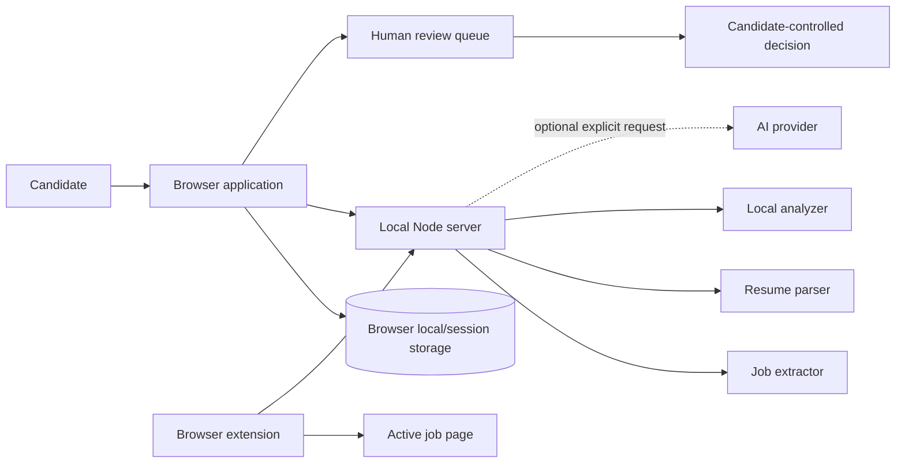
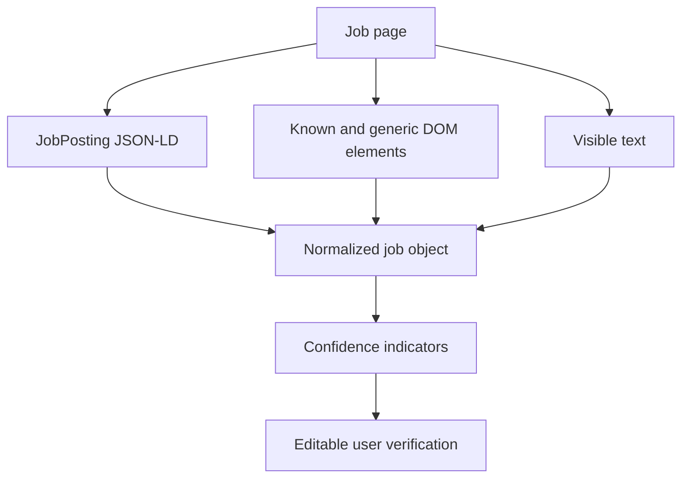

# Architecture

ApplyPilot consists of a local Node.js server, a browser application, and a Manifest V3 browser extension.

## System overview



## Components

### Local Node server

`server.mjs` serves the app, enforces request limits, parses resumes in memory, extracts job fields, runs analysis, optionally calls an AI provider, and holds the latest extension capture and routine synced profile in memory.

It binds to `127.0.0.1` by default.

### Browser application

The app stores the candidate workspace in browser storage:

```text
applypilot.profile.v1
applypilot.resumes.v1
applypilot.analysis.v1
applypilot.job.v1
applypilot.applications.v1
applypilot.settings.v1
```

### Extension

The extension operates only after explicit clicks. It captures the active job page, communicates with localhost, and fills a narrow set of routine contact fields.

## Local API

| Method | Endpoint | Purpose |
|---|---|---|
| `GET` | `/api/health` | Server health and version |
| `POST` | `/api/extract-job` | Normalize supplied job content |
| `POST` | `/api/capture` | Store and normalize the latest extension capture |
| `GET` | `/api/capture` | Return the latest capture |
| `DELETE` | `/api/capture` | Clear the latest capture |
| `POST` | `/api/profile-sync` | Store routine contact fields in memory |
| `GET` | `/api/profile-sync` | Return the routine synced profile |
| `POST` | `/api/resume/extract` | Parse a resume in memory |
| `POST` | `/api/analyze` | Run local or provider-assisted analysis |

## Storage boundaries

### Browser storage

Persistent until the user clears site data:

- profile;
- resume records and extracted text;
- current job;
- analysis;
- application history;
- settings;
- optionally a remembered API key.

### Server memory

Temporary until process exit or explicit clearing:

- latest browser capture;
- routine extension-sync profile.

### Filesystem

Uploaded resumes, captures, profile data, and provider keys are not written to disk by the app.

## Extraction pipeline



Structured data takes priority over page elements and visible-text heuristics.

## Analysis pipeline

The local analyzer compares the candidate profile, resume library, and verified job input for:

- role-family alignment;
- skill overlap;
- experience requirements;
- location preferences;
- common citizenship, clearance, sponsorship, export-control, and contract patterns;
- resume role-family and keyword overlap;
- reviewable routine and sensitive answers.

## Provider flow

1. Local analysis runs first.
2. Candidate profile, capped resume text, job content, and local baseline are prepared.
3. The selected provider is instructed not to invent facts and to return JSON.
4. Output is normalized.
5. Sensitive answers are forced to unapproved status.
6. Provider failure returns the local result.

## Production warning

Before public multi-user hosting, add authentication, per-user authorization, strict origin validation, extension/session authorization, TLS, rate limiting, encrypted storage, secrets management, deletion controls, and independent security review.
